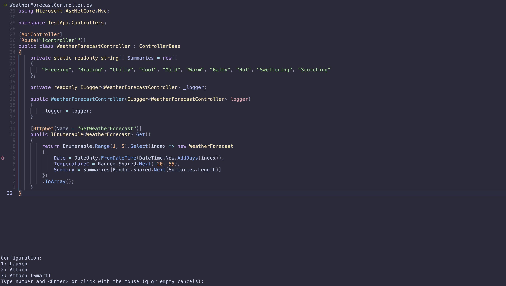

# nvim-dap-cs

An extension for [nvim-dap][1] providing adapter and configurations for launching .NET Core debugger ([netcoredbg][2]).




## Features

- Launch a .NET Core project
- Attach to a .NET Core process
- Smart attach to a .NET Core process

### Requirements

- [Neovim][3]
- [nvim-dap][1] - DAP client for [Neovim][3]
- [netcoredbg][2] - .NET Core debugger

### Installation
- Install like any other neovim plugin:
  - If using [vim-plug][4]: `Plug 'nicholasmata/nvim-dap-cs'`
  - If using [packer.nvim][5]: `use 'nicholasmata/nvim-dap-cs'`
  - If using [lazy.nvim][6]: `{ 'nicholasmata/nvim-dap-cs', dependencies = { 'mfussenegger/nvim-dap' } }`

### Usage

### Register the plugin

Call the setup function in your `init.vim` to register the adapter and the configurations:

```vimL
require('dap-cs').setup()
```

### Configuring

It is possible to customize nvim-dap-cs by passing a config table in the setup function.

The example below shows all the possible configurations:

```lua
require('dap-cs').setup(
  -- Additional dap configurations can be added.
  -- dap_configurations accepts a list of tables where each entry
  -- represents a dap configuration. For more details do:
  -- :help dap-configuration
  dap_configurations = {
    {
      -- Must be "coreclr" or it will be ignored by the plugin
      type = "coreclr",
      name = "Attach remote",
      mode = "remote",
      request = "attach",
    },
  },
  netcoredbg = {
    -- the path to the executable netcoredbg which will be used for debugging.
    -- by default, this is the "netcoredbg" executable on your PATH.
    path = "netcoredbg" 
  }
)
```

[1]: https://github.com/mfussenegger/nvim-dap
[2]: https://github.com/Samsung/netcoredbg
[3]: https://github.com/neovim/neovim
[4]: https://github.com/junegunn/vim-plug
[5]: https://github.com/wbthomason/packer.nvim
[6]: https://github.com/folke/lazy.nvim
